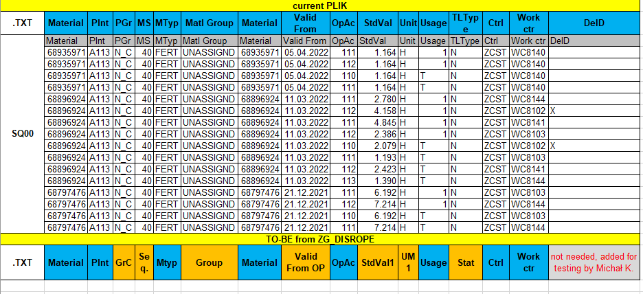

This is [jira](https://scfs-tech.atlassian.net/browse/OP-123) ticket

we need pars and save this layout  
```
+----+----+----+--------+--------+---+----+----+--------+-------------+---+-----------+----+----------+----+----------+----+-----------+----+-----------+----+----------+----+-------------+-------------+-------------+-------------+----------------------------------------+------------------------------+----------------------------------------+------------+------+-----+----+------+------+------+----+------+------+------+---+
|Ctrl|Plnt|MTyp|Material|Group   |GrC|Seq.|OpAc|Work ctr|Base Quantity|UoM|    StdVal1|UM 1|   StdVal2|UM 2|   StdVal3|UM 3|    StdVal4|UM 4|    StdVal5|UM 5|   StdVal6|UM 6|Valid From MA|Valid From AL|Valid From SQ|Valid From OP|Material Description                    |Plant Description             |Work Ctr Description                    |User Name   |TLType|Usage|Stat|ActTy4|ActTy5|ActTy6|SVK |ActTy1|ActTy2|ActTy3|BUM|
+----+----+----+--------+--------+---+----+----+--------+-------------+---+-----------+----+----------+----+----------+----+-----------+----+-----------+----+----------+----+-------------+-------------+-------------+-------------+----------------------------------------+------------------------------+----------------------------------------+------------+------+-----+----+------+------+------+----+------+------+------+---+
|ZCST|A113|HALB|384714  |50030348|2  |0   |111 |WC8130  |       1,000 |KG |     0.082 |H   |    0.082 |H   |    0.082 |AU  |     0.082 |AU  |     0.082 |AU  |          |    |01.01.2016   |01.01.2016   |01.01.2016   |01.01.2016   |55 LJ HB MZ NRP TUB FBL                 |UBF-ES SU Leioa               |BWI Line REFIT                          |HIJDRA_S    |N     |T    |3   |GB0012|GB0011|      |GPC1|GB0001|GB0002|GB0003|KG |
|ZCST|A113|HALB|384714  |50030348|1  |0   |111 |WC8130  |       1,000 |KG |     0.082 |H   |    0.082 |H   |    0.082 |AU  |     0.082 |AU  |     0.082 |AU  |          |    |03.03.2008   |03.03.2008   |01.01.2016   |01.01.2016   |55 LJ HB MZ NRP TUB FBL                 |UBF-ES SU Leioa               |BWI Line REFIT                          |RAAD_M      |N     |1    |4   |GB0012|GB0011|      |GPC1|GB0001|GB0002|GB0003|KG |
|ZCST|A113|HALB|384723  |50030352|2  |0   |111 |WC8130  |       1,000 |KG |     0.082 |H   |    0.082 |H   |    0.082 |AU  |     0.082 |AU  |     0.082 |AU  |          |    |01.01.2016   |01.01.2016   |01.01.2016   |01.01.2016   |FATBLEND LIGERESA                       |UBF-ES SU Leioa               |BWI Line REFIT                          |HIJDRA_S    |N     |T    |3   |GB0012|GB0011|      |GPC1|GB0001|GB0002|GB0003|KG |
|ZCST|A113|HALB|384723  |50030352|1  |0   |111 |WC8130  |       1,000 |KG |     0.082 |H   |    0.082 |H   |    0.082 |AU  |     0.082 |AU  |     0.082 |AU  |          |    |03.03.2008   |03.03.2008   |01.01.2016   |01.01.2016   |FATBLEND LIGERESA                       |UBF-ES SU Leioa               |BWI Line REFIT                          |RAAD_M      |N     |1    |4   |GB0012|GB0011|      |GPC1|GB0001|GB0002|GB0003|KG |
```
into this layout 
```
+---------+----+---+--+----+----------+--------+----------+----+----------+----+-----+------+----+--------+----+
| Material|Plnt|PGr|MS|MTyp|Matl Group|Material|Valid From|OpAc|    StdVal|Unit|Usage|TLType|Ctrl|Work ctr|DeID|
+---------+----+---+--+----+----------+--------+----------+----+----------+----+-----+------+----+--------+----+
| 8980857 |C107|N_C|40|HALB|UNASSIGND |8980857 |04.02.2022|0110|    0.229 |H   |T    |N     |ZCST|WCD846  |    |
| 8980857 |C107|N_C|40|HALB|UNASSIGND |8980857 |28.02.2022|0110|    0.381 |H   |T    |N     |ZCST|WCD846  |    |
```

mapping 




Create env with python 3,10+

In Unilever environment it is recommended to store packages in shared location for your security, and it is needed for
deployment to production/QA servers. 3rd party developers don't need adjust to this rule.

```command
py -3.9 -m venv env
env\scripting\activate
py -m pip install -r requirements.txt --no-index --find-links=\\s2.ms.unilever.com\dfs\ES-GROUPS\cor\frd\UFO-General\INTERFACE\UPIT\pypi\
py -m pip install --upgrade pip
```

It is recommended to store all wheels on internal scfs folder.
\\s2.ms.unilever.com\dfs\ES-GROUPS\cor\frd\UFO-General\INTERFACE\UPIT\pypi\
Remember to save whl on pypi folder to user --find-links=

```command
py -m pip download -r requirements.txt -d \\s2.ms.unilever.com\dfs\ES-GROUPS\cor\frd\UFO-General\INTERFACE\UPIT\pypi\
```

## setup

* run via cli from cmd
* in case `s1p` is not accessible, extend  cli os.environ['COMPUTERNAME'] == for you local environment root folder.

## usage

```commandline
python cli.py UFO_NPD_BOT_ROUTING.20220516061613.69937.002V5iiX.S1P.csv
```
